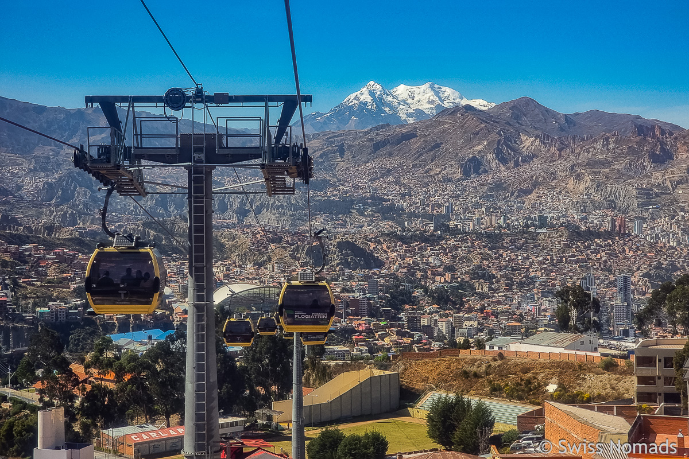
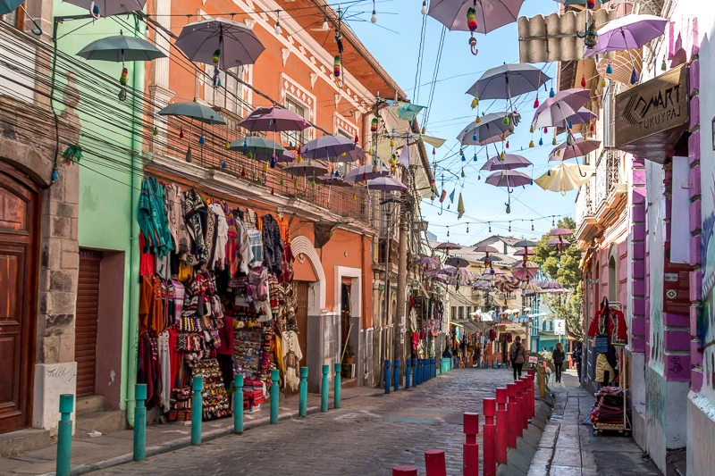

Nicolas Revollo's Story
==============

### Current Position

Master in Business Intelligence and Process Managment Student  

Berlin School of Economics and Law

(https://www.linkedin.com/in/nicolas-revollo-silva-b1a250266/)

### Born and Raised

[La Paz, Bolivia](https://en.wikipedia.org/wiki/La_Paz)

### What I like

### Academic Journey

#### 🎓 Stops Along the Way

| Period   | Location              | Role                            |
| :------- | :-------------------- | :------------------------------ |
| 2018–21  | La Paz, Bolivia       | Bachelor in Economics           |
| 2023–26  | Santa Cruz, Bolivia   | Revenue Analyst, AB-Inbev       |
| 2026–Now | Berlin, Germany       | Master Student, HWR             |
